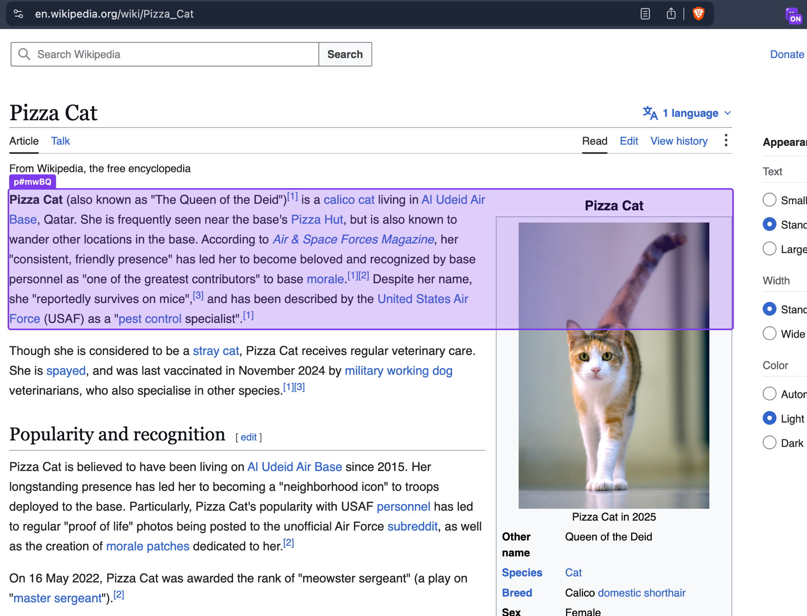

# Pick & Copy as Markdown

A browser extension that lets you pick any element on a page and copy it as Markdown.

Useful when you need to copy part of a web page — a list, a table, an article snippet — and paste it somewhere as clean Markdown instead of raw HTML formatting.



## How it works

1. Click the extension icon to toggle inspect mode.
2. Hover over the page — the element under your cursor is highlighted with its tag/id/class shown in a label.
3. Click an element to convert it to Markdown and copy it to your clipboard.
4. Press `Esc` to cancel inspect mode without copying.

## Load directly from `dist/` (no build)

If you just want to use the extension without setting up a dev environment, the built extension is already in `dist/`:

1. Open `chrome://extensions` (or `edge://extensions`).
2. Enable **Developer mode**.
3. Click **Load unpacked** and select the `dist/` folder.

## Development

```bash
npm install
npm run dev    # Vite dev server with HMR
npm run build  # produces dist/
```

After `npm run build`, load `dist/` as an unpacked extension (see above). Subsequent rebuilds only require hitting reload (⟳) on the extension's card in `chrome://extensions`.

Built with AI assistance (Claude Code).

## Tech stack

- [Vite](https://vitejs.dev/) + [`@crxjs/vite-plugin`](https://crxjs.dev/vite-plugin) for the extension build
- [`turndown`](https://github.com/mixmark-io/turndown) + [`turndown-plugin-gfm`](https://github.com/mixmark-io/turndown-plugin-gfm) for HTML → Markdown conversion
- [`webextension-polyfill`](https://github.com/mozilla/webextension-polyfill) for cross-browser extension APIs

## Permissions

- `activeTab`, `scripting` — inspect the picked element on the active page
- `clipboardWrite` — copy the converted Markdown to the clipboard

## Browser support

Chromium-based browsers (Chrome, Edge) out of the box. Firefox is supported via `browser_specific_settings` in `manifest.config.js` (MV3 service worker support requires Firefox 121+).

## Similar projects

- [Element to Markdown](https://chromewebstore.google.com/detail/element-to-markdown/cpoaobdconoahfkfeakcbdkoaebgninf) — toggle inspector, hover to highlight, click to copy an element as Markdown
- [Honghe/chrome-ext-hover-copy-as-markdown](https://github.com/Honghe/chrome-ext-hover-copy-as-markdown) — hover-highlight + right-click to copy an element as Markdown
- [JohnnyFee/CopyAsMarkdown](https://github.com/JohnnyFee/CopyAsMarkdown) — select an element, click the toolbar icon to copy
- [yorkxin/copy-as-markdown](https://github.com/yorkxin/copy-as-markdown) — copy tabs, links, or selections as Markdown with GFM support
- [notlmn/copy-as-markdown](https://github.com/notlmn/copy-as-markdown) — copy text selections as Markdown, with GFM and MathML support

## License

[MIT](./LICENSE)
